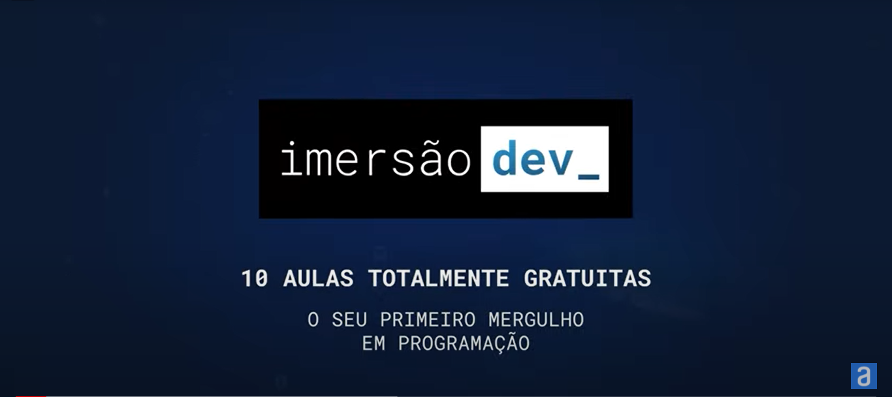
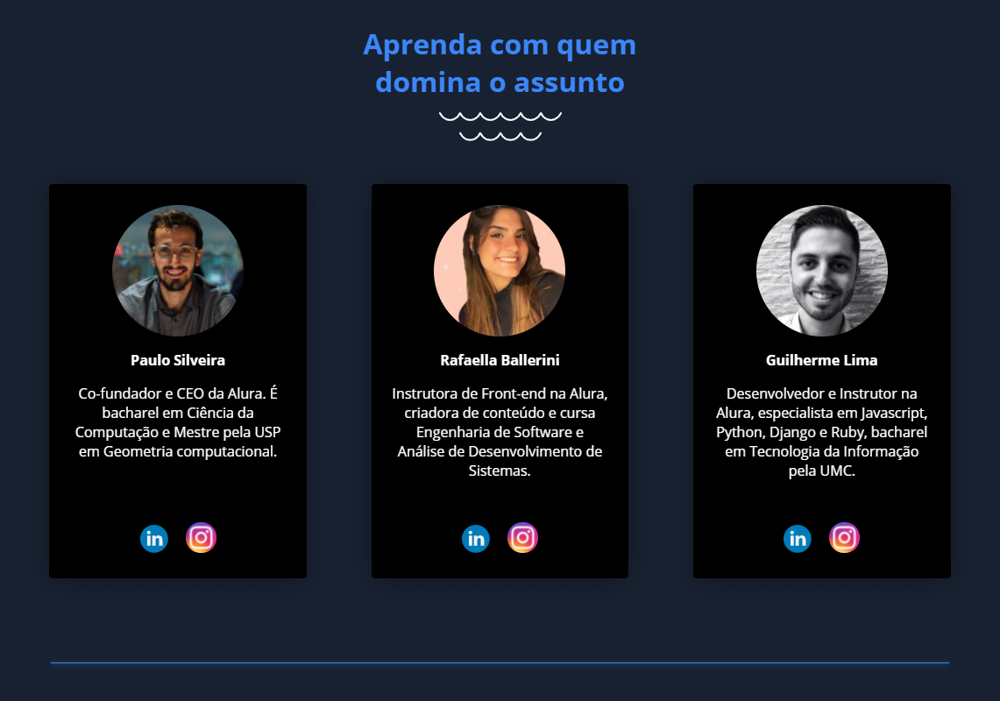
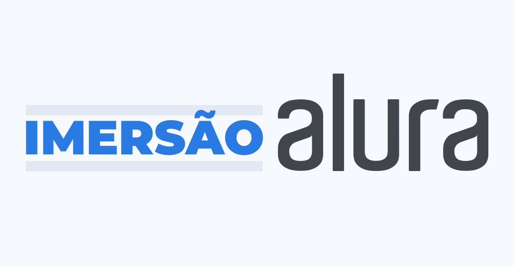

<h2 align="center"> 💻 Imersão Dev  </h2>

    

 

[ImersaoDev](https://imersao.dev/)

## 🎯 Desafios

Aprendizado feito na prática. Por isso, nessa imersão tem diversos desafios para consolidar o conhecimento e evoluir em programação, mesmo sem ter nenhuma experiência prévia.

## 📘 Didática Alura

Todas as aulas estão sendo construídas a partir da didática e qualidade da maior escola de tecnologia online do Brasil, com especialistas em programação e front-end.

## 🤝 Comunidade

Os instrutores e instrutoras estarão disponíveis para correção de exercícios e responder dúvidas no Discord exclusivo da Imersão Dev. Você também vai poder conhecer pessoas que estão no mesmo nível que o seu, discutir sobre carreira e trocar experiências práticas.

---

## 📍 Menu de Projetos

- [Projeto 01 - Conversor de Moedas]()
- [Projeto 02 - Mentalista]()
- [Projeto 03 - AluraFlix]()
- [Projeto 04 - SuperTrunfo]()

---

## 📌 O que você vai aprender?

- Mergulhar em HTML, CSS e JavaScript do zero.

- Encarar desafios personalizados.

- Desenvolver o seu portfólio, desde o primeiro dia.

- Conhecer e participar da comunidade developer.

- Assistir a lives exclusivas com especialistas no assunto.

- Ao final, obter um portfólio que comprova sua participação e conhecimento.

---

## 👥 Instrutores

 

##### 👨🏻‍💻 Paulo Silveira

- 
- 

##### 👩‍💻 Rafaella Ballerini

- 
- 

##### 👨🏻‍💻 Guilherme Lima

- 
- 

---

### 🚧Projeto em fase de Construção...⏳

---

### 🚀 Tecnologias Aprendidas/Usadas

  <strong>Esses projetos forão desenvolvido com as seguintes tecnologias:</strong>

 

   

---

 

---

### 👤 Autor 

**Savio Nascimento**

- 
- 

---

[⬆️ Topo](#top)  
